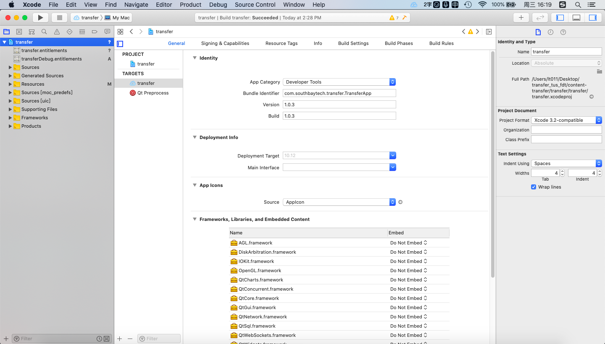
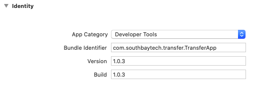
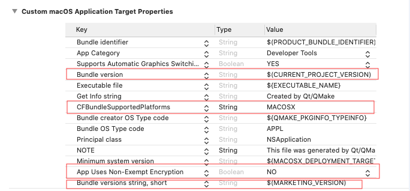
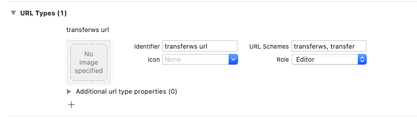
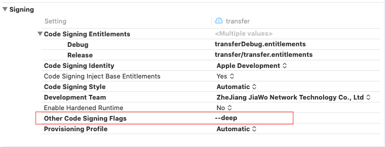
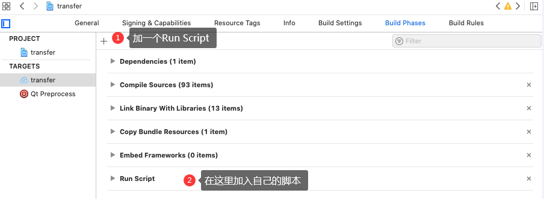
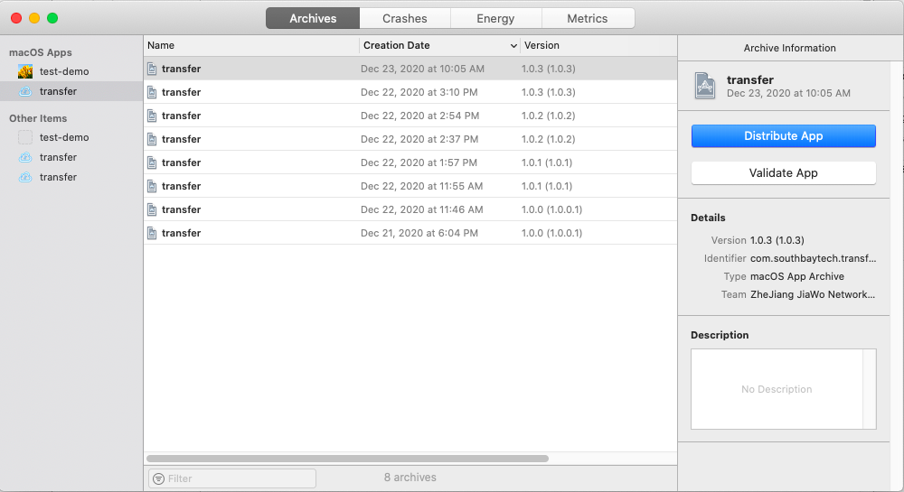

# Qt mac端 Xcode编译 笔记

## 一、前言
由于用QT编译出来的app，打包成dmg，在mac上安装后，后出现安全性的问题，现在需要解决该问题。
### 项目环境
macOS Catalina 10.15.2
Xcode Version 11.3(11C29)
Qt Creater 4.11.0(Based on Qt 5.14.0)

## 二、
1. 先再新建一个Identifier
[developer.apple.com](https://developer.apple.com/account/resources/identifiers/list)

2. 再appstoreconnect上新建一个app，注意一个app对应的一个Identifier
[appstoreconnect](https://appstoreconnect.apple.com/apps)

## 三、QT工程转XCode工程
### 转换工程
先cd到qt的工程目录下再：
```$qmake xx.pro -spec macx-xcode```
执行以上命令后，会在 Qt工程目录下生成一个 xx.xcodeproj文件，在 xcode 中可以直接打开这个文件即可。 

[参考网址](https://blog.csdn.net/luoyayun361/article/details/79435216)

## 四、配置XCode工程
用XCode打开xx.xcodeproj，如下图所示：

主要填的项目：
1. General项目里面
    1. Identity里面的各项

    2. Apple Icons选择：制作图标的免费网址：[图标工厂-一键生成所有mac开发需要图标](https://icon.wuruihong.com/#/mac)
2. Signing&Capabilities
    1. Signing各项
3. Info
    1. Custom macOS Application Target Properties

    2. URL Types：这一步是网页上点击按钮，能弹出transfer应用的重要一步！

4. Build Settings
    1. Signing

5. Build Phases
新建一个 Run Script 项，加入自己的脚本。
主要是要拷贝一些应用程序所需要的dll文件。

脚本代码：
```
# Type a script or drag a script file from your workspace to insert its path.
apppath="${BUILT_PRODUCTS_DIR}/transfer.app"
qtpath="/Users/lt011/Qt/5.12.6/clang_64/"
qtbinpath="${qtpath}bin/"
qtlibpath="${qtpath}lib/"
frameworkpath="${apppath}/Contents/Frameworks/"
thirdpartpath="/Users/lt011/Desktop/transfer_tus_fdt/content-transfer/transfer/third-part/"
thirdlibpath="${thirdpartpath}lib/"
thirdshellpath="/Users/lt011/Desktop/transfer_tus_fdt/content-transfer/transfer/mac-deploy/shell/"
devdeploypath="/Users/lt011/Desktop/transfer_tus_fdt/content-transfer/transfer/dev-deploy/"
echo $apppath
echo $qtpath
echo $qtbinpath
echo $qtlibpath
echo $frameworkpath
echo $thirdlibpath
echo "====clean===="
#rm -rf $apppath
echo "====start===="
echo 1
install_name_tool -change libTUS.1.dylib @executable_path/libTUS.1.dylib ${apppath}/Contents/MacOS/transfer
echo 2
cp ${thirdlibpath}libquazip.1.dylib ${thirdlibpath}autoUpgrade ${apppath}/Contents/MacOS/
echo 3
cp ${thirdpartpath}fdt_env/*.jar ${apppath}/Contents/MacOS/
cp -R ${thirdpartpath}fdt_env/mac/* ${apppath}/Contents/MacOS/
cp -R ${devdeploypath}JKS ${apppath}/Contents/MacOS/
cp ${thirdlibpath}libTUS.1.dylib ${apppath}/Contents/MacOS/
echo 4
${qtbinpath}macdeployqt $apppath -verbose=1
echo "===end==="
```

## 五、Build工程
1. 菜单栏上 Product->Scheme->Edit Scheme，选择好需要debug还是release模式
2. Product——>Clean
3. Product——>Build

build后，工程目录下也会多出一堆相关联的文件出来。

目前为止，用这个编译出来的app应用程序，直接去打包成dmg文件，测试了几台机子，还没有出现安全性的问题。
我观察了一下，发现编译出来的app文件里面已经有了各项相关签名文件，应该就是不会报安全性问题的原因所在。

## 六、Archive工程
1. 如果要传到app store上面，那么就需要进行Archive步骤，
Product——>Archive
2. 弹出一个界面出来：

3. Validate App
一步步点击下去，直到成功。
4. Distribute App
一步步点击下去，直到成功。
5. 如果不小心关掉窗口，可以选择Window——>Organizer,重新打开界面。

## 七、参考资料

App怎么上架到苹果商店（app store）？上架app的流程。
https://zhuanlan.zhihu.com/p/104987262

基于Qt5的桌面应用程序上传到Mac App Store流程
https://blog.csdn.net/qq_17485343/article/details/50471197

App Store上架流程/苹果app发布流程
https://www.jianshu.com/p/fc65955cdbf0?utm_campaign=maleskine&utm_content=note&utm_medium=seo_notes&utm_source=recommendation

Objective-C @executable_path、@loader_path和@rpath
https://www.cnblogs.com/yangwenhuan/p/10028673.html

Qt程序上架Mac App Store 笔记
https://blog.csdn.net/u013820121/article/details/106624994

mac下Qt缺失libiodbc.2.dylib和libpq.5.dylib解决方案
https://blog.csdn.net/yutianyue126/article/details/106911948/

Mac必备神器Homebrew
https://zhuanlan.zhihu.com/p/59805070

mac homebrew-cask
https://github.com/Homebrew/homebrew-cask

mac PostgresApp 
https://github.com/PostgresApp/PostgresApp/releases

Xcode编译错误:code object is not signed at all
https://blog.csdn.net/weixin_33985507/article/details/90336429

QT for macOS应用程序打包发布App Store记录
https://blog.csdn.net/xiaohai7521s/article/details/80267226

Mac下将QT程序打包成能发布到Mac App store的pkg安装包
https://blog.csdn.net/casun_li/article/details/71741968

CodeSign的签名机制
https://www.dazhuanlan.com/2019/11/28/5ddf7072518d8/

Qt for iOS：将ipa安装包发布到App store
https://blog.csdn.net/wsj18808050/article/details/42298691

基于Qt开发的应用程序上传到Mac App store 流程
https://www.jianshu.com/p/39d0632e71d1

苹果开发文档 About App Sandbox
https://developer.apple.com/library/archive/documentation/Security/Conceptual/AppSandboxDesignGuide/AboutAppSandbox/AboutAppSandbox.html

苹果开发者证书列表
https://developer.apple.com/account/resources/certificates/list

苹果商店开发者列表
https://appstoreconnect.apple.com/apps

Transporter上传App ipa包报错
https://www.jianshu.com/p/8cb114a7a35a

iOS13 Xcode11打包上传方式和上传APP报错（A downloaded software component is corrupted and will not be used）
https://blog.csdn.net/qq_27909209/article/details/102461160

Mac下将QT程序打包成能发布到Mac App store的pkg安装包
https://blog.csdn.net/casun_li/article/details/71741968

App Store 上架关键步骤：出口合规信息、内容版权、广告标识符的选择
http://zhanglinhai.com/archives/689

[App Store Connect帮助]三、管理 App 和版本（2.4）输入 App 信息：提供加密出口合规证明文稿...
https://blog.csdn.net/weixin_30902675/article/details/97750527

Linux最常用命令：简单易学，但能解决95%以上的问题
https://www.jianshu.com/p/5a5b003f8fe2

Apple ID,APP ID,Bundle ID，iOS Certificates，iOS Provisioning Profiles各自含义以及之间的关系
https://blog.csdn.net/wangsun300/article/details/100043095

iOS APP沙盒目录
https://www.jianshu.com/p/9cc4f0975d1d

IOS App Sandbox 工作机制
https://www.jianshu.com/p/a7e0f799ea0a

图标工厂-一键生成所有mac开发需要图标
https://icon.wuruihong.com/#/mac

[iOS开发技巧：使用Xcode DEBUG模式和RELEASE模式模式](https://www.jianshu.com/p/e0c03f93414a)

[iOS密码管理Keychain的使用](https://www.jianshu.com/p/6c2265a82f72)

[ github/PatchLion/Qt5AppPushToMacAppStore ](https://github.com/PatchLion/Qt5AppPushToMacAppStore)

[[Xcode]iOS代码签名(Code Signing)](https://blog.csdn.net/shimazhuge/article/details/53162192)

[（译）iOS Code Signing: 解惑](https://www.cnblogs.com/zilongshanren/archive/2011/08/30/2159086.html)

[iOS Code Signing: Under The Hood](https://www.raywenderlich.com/3078-ios-code-signing-under-the-hood)

[MacOSx打包dmg文件（带背景图片）](https://blog.csdn.net/u013943420/article/details/82527053)

[App Store Connect 帮助/出口合规信息概述](https://help.apple.com/app-store-connect/#/dev88f5c7bf9)

[解锁macOS安全与隐私允许【任何来源】](https://blog.csdn.net/lxyoucan/article/details/111994328)

[mac dmg包签名及公证](https://blog.csdn.net/luoshabugui/article/details/109295413)


